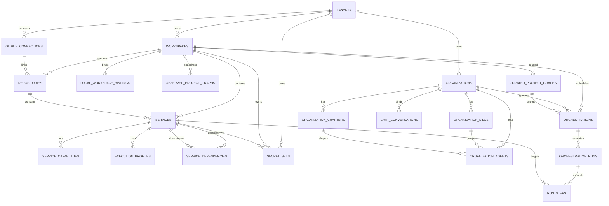

# ora-automation ERD

## 0. 문서 목적

이 문서는 `ora-automation`의 범용화 아키텍처를 위한 데이터 모델 관계를 정리한다.

대상 범위는 두 계층이다.

1. 프로젝트 계층
2. 조직 계층

핵심 원칙은 다음과 같다.

1. 프로젝트 구조와 조직 구조는 분리한다.
2. 실행 단위는 `Repository`가 아니라 `Service`다.
3. 의사결정 단위는 `Organization`이다.
4. 실행 이력은 `Orchestration -> Run -> Step`으로 추적한다.

---

## 1. 상위 ERD

---

## 2. 프로젝트 계층

## 2.1 tenants

플랫폼 고객 단위다.

| 컬럼 | 타입 | 설명 |
| --- | --- | --- |
| id | uuid | PK |
| name | varchar(128) | 테넌트명 |
| slug | varchar(128) | 고유 slug |
| owner_user_id | uuid | 소유자 |
| status | varchar(32) | `active`, `disabled` |
| created_at | timestamptz | 생성시각 |
| updated_at | timestamptz | 수정시각 |

제약:

1. `slug` unique

## 2.2 workspaces

레포 묶음 또는 제품군 단위다.

| 컬럼 | 타입 | 설명 |
| --- | --- | --- |
| id | uuid | PK |
| tenant_id | uuid | FK -> tenants.id |
| name | varchar(128) | 워크스페이스명 |
| slug | varchar(128) | 고유 slug |
| workspace_type | varchar(32) | `local_only`, `local_git`, `linked_repo`, `linked_org`, `hybrid` |
| vcs_provider | varchar(32) | `github`, `gitlab`, `local` |
| default_branch | varchar(128) | 기본 브랜치 |
| status | varchar(32) | `active`, `archived` |
| metadata_json | jsonb | 추가 메타데이터 |
| created_at | timestamptz | 생성시각 |
| updated_at | timestamptz | 수정시각 |

제약:

1. `(tenant_id, slug)` unique

## 2.3 github_connections

GitHub 연결 범위와 계정 정보를 나타낸다.

| 컬럼 | 타입 | 설명 |
| --- | --- | --- |
| id | uuid | PK |
| tenant_id | uuid | FK -> tenants.id |
| provider | varchar(32) | `github` |
| account_type | varchar(32) | `user`, `org` |
| account_login | varchar(128) | GitHub login/org |
| installation_id | varchar(128) | app 설치 ID 또는 식별자 |
| access_mode | varchar(32) | `repo_only`, `org_wide` |
| status | varchar(32) | `active`, `disabled` |
| metadata_json | jsonb | 추가 정보 |
| created_at | timestamptz | 생성시각 |
| updated_at | timestamptz | 수정시각 |

## 2.4 local_workspace_bindings

워크스페이스와 로컬 경로 연결 정보다.

| 컬럼 | 타입 | 설명 |
| --- | --- | --- |
| id | uuid | PK |
| workspace_id | uuid | FK -> workspaces.id |
| local_root_path | text | 로컬 루트 경로 |
| os_type | varchar(32) | `macos`, `linux`, `windows` |
| shell_type | varchar(32) | `zsh`, `bash`, `powershell` |
| is_primary | boolean | 기본 작업 경로 여부 |
| last_scanned_at | timestamptz | 마지막 로컬 스캔 시각 |
| created_at | timestamptz | 생성시각 |
| updated_at | timestamptz | 수정시각 |

## 2.5 repositories

실제 Git 레포 단위다.

| 컬럼 | 타입 | 설명 |
| --- | --- | --- |
| id | uuid | PK |
| workspace_id | uuid | FK -> workspaces.id |
| github_connection_id | uuid | FK -> github_connections.id nullable |
| source_kind | varchar(32) | `local_untracked`, `local_git`, `github_repo`, `github_org_repo` |
| provider | varchar(32) | `github`, `gitlab`, `local` |
| org_name | varchar(128) | Git org/user |
| repo_name | varchar(128) | 레포명 |
| clone_url | text | clone URL |
| git_remote_url | text | remote URL |
| default_branch | varchar(128) | 기본 브랜치 |
| local_path | text | 로컬 경로 |
| repo_kind | varchar(32) | `monorepo`, `single-service`, `infra`, `docs` |
| is_org_managed | boolean | org 단위 연결에서 수집된 repo 여부 |
| status | varchar(32) | `connected`, `syncing`, `error` |
| last_synced_at | timestamptz | 마지막 sync |
| created_at | timestamptz | 생성시각 |
| updated_at | timestamptz | 수정시각 |

제약:

1. `(workspace_id, provider, org_name, repo_name)` unique

## 2.6 services

실행과 분석의 기본 단위다.

| 컬럼 | 타입 | 설명 |
| --- | --- | --- |
| id | uuid | PK |
| workspace_id | uuid | FK -> workspaces.id |
| repository_id | uuid | FK -> repositories.id |
| name | varchar(128) | 표시 이름 |
| slug | varchar(128) | 서비스 식별자 |
| root_path | text | 레포 내 경로 |
| service_type | varchar(32) | `frontend`, `backend`, `android`, `ai`, `docs`, `infra`, `worker` |
| runtime | varchar(32) | `node`, `python`, `jvm`, `android`, `docker`, `static` |
| framework | varchar(64) | `react`, `fastapi`, `spring`, `android-gradle` 등 |
| language | varchar(32) | 주 언어 |
| observed_confidence | numeric(5,4) | 자동 추론 신뢰도 |
| curated | boolean | 사용자 확정 여부 |
| status | varchar(32) | `active`, `disabled` |
| metadata_json | jsonb | 포트, env 등 |
| created_at | timestamptz | 생성시각 |
| updated_at | timestamptz | 수정시각 |

제약:

1. `(workspace_id, slug)` unique
2. `(repository_id, root_path)` unique

## 2.7 service_capabilities

서비스 능력 단위다.

| 컬럼 | 타입 | 설명 |
| --- | --- | --- |
| id | uuid | PK |
| service_id | uuid | FK -> services.id |
| capability | varchar(64) | `web-ui`, `http-api`, `e2e`, `unit-test`, `llm-service`, `queue-consumer` 등 |
| source | varchar(32) | `detected`, `manual`, `imported` |
| confidence | numeric(5,4) | 신뢰도 |
| metadata_json | jsonb | 탐지 근거 |

제약:

1. `(service_id, capability)` unique

## 2.8 service_dependencies

서비스 간 의존 관계다.

| 컬럼 | 타입 | 설명 |
| --- | --- | --- |
| id | uuid | PK |
| upstream_service_id | uuid | FK -> services.id |
| downstream_service_id | uuid | FK -> services.id |
| dependency_type | varchar(32) | `http`, `queue`, `db`, `build`, `runtime`, `test-fixture` |
| required_for | varchar(32) | `run`, `test`, `deploy`, `research` |
| confidence | numeric(5,4) | 신뢰도 |
| metadata_json | jsonb | 근거 |

제약:

1. `(upstream_service_id, downstream_service_id, dependency_type, required_for)` unique
2. `upstream_service_id != downstream_service_id`

## 2.9 execution_profiles

서비스별 실행 계약이다.

| 컬럼 | 타입 | 설명 |
| --- | --- | --- |
| id | uuid | PK |
| workspace_id | uuid | FK -> workspaces.id |
| service_id | uuid | FK -> services.id nullable |
| profile_name | varchar(128) | 예: `node-playwright` |
| runtime_family | varchar(32) | `python`, `node`, `jvm`, `android` |
| executor_type | varchar(32) | `in_process`, `subprocess`, `remote_worker` |
| worker_kind | varchar(64) | `python-research`, `node-qa`, `android-qa` |
| install_command | text | 설치 커맨드 |
| build_command | text | 빌드 커맨드 |
| start_command | text | 실행 커맨드 |
| test_command | text | 테스트 커맨드 |
| healthcheck_url | text | healthcheck |
| env_schema | jsonb | 필요한 env |
| timeout_seconds | int | 제한 시간 |
| retry_policy | jsonb | 재시도 정책 |
| metadata_json | jsonb | 추가 설정 |

제약:

1. `(workspace_id, profile_name)` unique

## 2.10 observed_project_graphs

자동 스캔 결과 스냅샷이다.

| 컬럼 | 타입 | 설명 |
| --- | --- | --- |
| id | uuid | PK |
| workspace_id | uuid | FK -> workspaces.id |
| version | int | 버전 |
| graph_json | jsonb | full observed graph |
| analyzer_version | varchar(64) | 분석기 버전 |
| summary_json | jsonb | 요약 |
| created_at | timestamptz | 생성시각 |

제약:

1. `(workspace_id, version)` unique

## 2.11 curated_project_graphs

사용자 확정 그래프다.

| 컬럼 | 타입 | 설명 |
| --- | --- | --- |
| id | uuid | PK |
| workspace_id | uuid | FK -> workspaces.id |
| base_observed_graph_id | uuid | FK -> observed_project_graphs.id |
| version | int | 버전 |
| graph_json | jsonb | full curated graph |
| created_by | uuid | 사용자 |
| summary_json | jsonb | 요약 |
| created_at | timestamptz | 생성시각 |

제약:

1. `(workspace_id, version)` unique

## 2.12 secret_sets

테넌트/워크스페이스/서비스 범위의 시크릿 참조다.

| 컬럼 | 타입 | 설명 |
| --- | --- | --- |
| id | uuid | PK |
| tenant_id | uuid | FK -> tenants.id nullable |
| workspace_id | uuid | FK -> workspaces.id nullable |
| service_id | uuid | FK -> services.id nullable |
| scope_type | varchar(32) | `tenant`, `workspace`, `service` |
| provider | varchar(64) | `github`, `google`, `npm`, `playwright`, `android` |
| secret_ref | text | secret manager key |
| metadata_json | jsonb | 마스킹 가능한 메타 |
| created_at | timestamptz | 생성시각 |
| updated_at | timestamptz | 수정시각 |

제약:

1. `scope_type`에 맞는 FK 하나만 활성화

---

## 3. 조직 계층

## 3.1 organizations

AI 회사 단위다.

| 컬럼 | 타입 | 설명 |
| --- | --- | --- |
| id | uuid | PK |
| tenant_id | uuid | FK -> tenants.id |
| name | varchar(128) | 조직명 |
| slug | varchar(128) | 조직 slug |
| description | text | 설명 |
| is_preset | boolean | 프리셋 여부 |
| pipeline_params | jsonb | deliberation 설정 |
| status | varchar(32) | `active`, `archived` |
| created_at | timestamptz | 생성시각 |
| updated_at | timestamptz | 수정시각 |

제약:

1. `(tenant_id, slug)` unique

## 3.2 organization_silos

미션 팀 단위다.

| 컬럼 | 타입 | 설명 |
| --- | --- | --- |
| id | uuid | PK |
| org_id | uuid | FK -> organizations.id |
| name | varchar(128) | 사일로명 |
| slug | varchar(128) | 식별자 |
| description | text | 설명 |
| display_order | int | 정렬 |
| created_at | timestamptz | 생성시각 |
| updated_at | timestamptz | 수정시각 |

제약:

1. `(org_id, slug)` unique

## 3.3 organization_chapters

전문성 공유 단위다.

| 컬럼 | 타입 | 설명 |
| --- | --- | --- |
| id | uuid | PK |
| org_id | uuid | FK -> organizations.id |
| name | varchar(128) | 챕터명 |
| slug | varchar(128) | 식별자 |
| chapter_prompt | text | 공유 프롬프트 |
| shared_directives | jsonb | 공통 지침 |
| shared_constraints | jsonb | 공통 제약 |
| shared_decision_focus | jsonb | 공통 포커스 |
| display_order | int | 정렬 |
| created_at | timestamptz | 생성시각 |
| updated_at | timestamptz | 수정시각 |

제약:

1. `(org_id, slug)` unique

## 3.4 organization_agents

실제 판단 주체다.

| 컬럼 | 타입 | 설명 |
| --- | --- | --- |
| id | uuid | PK |
| org_id | uuid | FK -> organizations.id |
| silo_id | uuid | FK -> organization_silos.id nullable |
| chapter_id | uuid | FK -> organization_chapters.id nullable |
| agent_id | varchar(128) | 내부 식별자 |
| display_name | varchar(128) | 영문 표시명 |
| display_name_ko | varchar(256) | 한국어 표시명 |
| role | varchar(64) | `ceo`, `planner`, `developer` 등 |
| is_clevel | boolean | C-level 여부 |
| enabled | boolean | 사용 여부 |
| weight_score | numeric(5,4) | 영향력 가중치 |
| personality_json | jsonb | 성격 |
| directives_json | jsonb | 개별 지침 |
| constraints_json | jsonb | 개별 제약 |
| decision_focus_json | jsonb | 개별 포커스 |
| weights_json | jsonb | scoring 가중치 |
| trust_map_json | jsonb | 신뢰도 |
| system_prompt_template | text | 시스템 프롬프트 |
| created_at | timestamptz | 생성시각 |
| updated_at | timestamptz | 수정시각 |

제약:

1. `(org_id, agent_id)` unique
2. 일반 agent는 chapter 또는 silo 소속 정책을 validator로 강제

## 3.5 chat_conversations

대화는 조직에 소속될 수 있다.

추가 컬럼:

| 컬럼 | 타입 | 설명 |
| --- | --- | --- |
| org_id | uuid | FK -> organizations.id nullable |

---

## 4. 실행 계층

## 4.1 orchestrations

사용자 요청 상위 객체다.

| 컬럼 | 타입 | 설명 |
| --- | --- | --- |
| id | uuid | PK |
| workspace_id | uuid | FK -> workspaces.id |
| organization_id | uuid | FK -> organizations.id nullable |
| curated_graph_id | uuid | FK -> curated_project_graphs.id nullable |
| orchestration_type | varchar(32) | `research`, `qa`, `ops`, `e2e`, `onboarding-scan` |
| intent | varchar(32) | `research`, `qa`, `ops` |
| target_scope | varchar(32) | `workspace`, `service`, `repository` |
| target_ids | jsonb | 대상 목록 |
| request_json | jsonb | 사용자 요청 원문 |
| planner_output | jsonb | planner 결과 |
| status | varchar(32) | `queued`, `running`, `completed`, `failed`, `partial` |
| created_by | uuid | 요청 사용자 |
| created_at | timestamptz | 생성시각 |
| updated_at | timestamptz | 수정시각 |

## 4.2 orchestration_runs

실행 회차다.

| 컬럼 | 타입 | 설명 |
| --- | --- | --- |
| id | uuid | PK |
| orchestration_id | uuid | FK -> orchestrations.id |
| run_number | int | 회차 |
| status | varchar(32) | 상태 |
| worker_summary_json | jsonb | 요약 |
| report_path | text | 리포트 경로 |
| artifact_index_json | jsonb | 산출물 인덱스 |
| started_at | timestamptz | 시작시각 |
| finished_at | timestamptz | 종료시각 |

제약:

1. `(orchestration_id, run_number)` unique

## 4.3 run_steps

실행 단계 단위다.

| 컬럼 | 타입 | 설명 |
| --- | --- | --- |
| id | uuid | PK |
| run_id | uuid | FK -> orchestration_runs.id |
| service_id | uuid | FK -> services.id nullable |
| step_type | varchar(32) | `analysis`, `planning`, `research`, `qa`, `e2e`, `report`, `healthcheck` |
| worker_type | varchar(64) | `python-research`, `node-qa`, `android-qa` |
| executor_name | varchar(128) | `ResearchExecutor` 등 |
| status | varchar(32) | 상태 |
| input_json | jsonb | 입력 |
| output_json | jsonb | 출력 |
| logs_path | text | 로그 |
| artifacts_json | jsonb | 산출물 |
| started_at | timestamptz | 시작시각 |
| finished_at | timestamptz | 종료시각 |

---

## 5. 핵심 관계 요약

## 5.1 프로젝트 관계

1. `Tenant`는 여러 `Workspace`를 가진다.
2. `Tenant`는 여러 `GitHubConnection`을 가질 수 있다.
3. `Workspace`는 하나 이상의 `LocalWorkspaceBinding`을 가질 수 있다.
4. `Workspace`는 여러 `Repository`를 가진다.
5. `Repository`는 여러 `Service`를 가진다.
6. `Service`는 여러 `Capability`를 가진다.
7. `Service`는 여러 다른 `Service`에 의존할 수 있다.
8. `Workspace`는 여러 번의 `Observed Graph`, `Curated Graph`를 가진다.

## 5.2 조직 관계

1. `Tenant`는 여러 `Organization`을 가진다.
2. `Organization`은 여러 `Silo`, `Chapter`, `Agent`를 가진다.
3. `Agent`는 `Silo`와 `Chapter`에 연결된다.
4. `Conversation`은 하나의 `Organization`에 연결될 수 있다.

## 5.3 실행 관계

1. `Workspace`는 여러 `Orchestration`을 가진다.
2. `Orchestration`은 하나의 `Organization`과 하나의 `Curated Graph`를 참조할 수 있다.
3. `Orchestration`은 여러 `Run`을 가진다.
4. `Run`은 여러 `Step`을 가진다.
5. `Step`은 특정 `Service`를 대상으로 실행될 수 있다.

---

## 6. 인덱스 정책

반드시 필요한 인덱스는 다음과 같다.

1. `workspaces(tenant_id, slug)`
2. `repositories(workspace_id, provider, org_name, repo_name)`
3. `services(workspace_id, slug)`
4. `services(repository_id, root_path)`
5. `service_capabilities(service_id, capability)`
6. `organization_agents(org_id, agent_id)`
7. `organization_silos(org_id, slug)`
8. `organization_chapters(org_id, slug)`
9. `orchestrations(workspace_id, status, created_at desc)`
10. `orchestration_runs(orchestration_id, run_number)`
11. `run_steps(run_id, status)`

---

## 7. 구현 주의사항

1. `Organization`과 `Workspace`를 같은 개념으로 합치면 안 된다.
2. `Repository`와 `Service`를 같은 개념으로 합치면 안 된다.
3. `Observed Graph`를 바로 운영 기준으로 쓰면 안 된다.
4. `Orchestration`이 target 문자열만 저장하는 구조로 남으면 안 된다.
5. `ExecutionProfile`은 문자열 옵션이 아니라 실행 계약이어야 한다.
6. `GitHub 연결 범위`와 `로컬 실행 위치`를 같은 필드로 뭉개면 안 된다.

---

## 8. 다음 단계

이 ERD 다음으로 이어질 구현 문서는 다음 두 개다.

1. [PROJECT_GRAPH_SCHEMA.md](/Users/mike/workspace/side_project/Ora/ora-automation/PROJECT_GRAPH_SCHEMA.md)
2. [REFACTOR_SEQUENCE.md](/Users/mike/workspace/side_project/Ora/ora-automation/REFACTOR_SEQUENCE.md)
