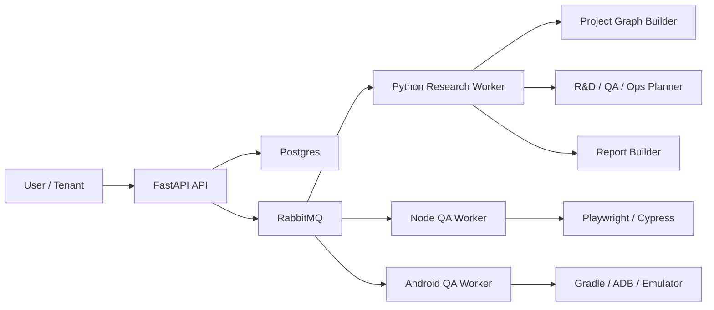

# ora-automation 일반화 아키텍처 설계안

## 0. 문서 목적

이 문서는 현재 `ora-automation`을 Ora 전용 자동화 도구에서 벗어나, 일반 사용자마다 다른 GitHub 조직/레포 구조를 수용할 수 있는 범용 자동화 플랫폼으로 확장하기 위한 기준 설계안이다.

핵심 목표는 다음 네 가지다.

1. 사용자마다 다른 레포 구조를 공통 모델로 정규화한다.
2. QA, R&D, Ops 자동화를 하나의 플랫폼에서 실행한다.
3. 특정 레포명이나 서비스명에 하드코딩되지 않게 만든다.
4. 런타임별로 가장 자연스러운 실행 방식을 선택한다.

핵심 방향은 다음 한 줄로 요약된다.

`레포를 직접 실행하는 플랫폼`이 아니라 `레포를 분석해서 프로젝트 그래프로 정규화한 뒤, 그래프 기반으로 자동화를 실행하는 플랫폼`으로 바꾼다.

---

## 0.1 기존 계획과의 정합성

이 문서는 기존 조직 설계를 폐기하는 문서가 아니다. 기존 계획은 그대로 유지하고, 이 문서는 그 위에 `멀티 테넌트 / 멀티 레포 / 멀티 런타임` 레이어를 추가하는 상위 아키텍처 문서다.

기준이 되는 기존 문서는 다음 두 개다.

1. [AGENT_ORG_CUSTOMIZATION_PLAN.md](/Users/mike/workspace/side_project/Ora/ora-automation/docs/AGENT_ORG_CUSTOMIZATION_PLAN.md)
2. [TOSS_REORG_PLAN.md](/Users/mike/workspace/side_project/Ora/ora-automation/docs/TOSS_REORG_PLAN.md)

정확한 관계는 다음과 같다.

1. `TOSS_REORG_PLAN.md`는 에이전트 역할 설계 문서다.
2. `AGENT_ORG_CUSTOMIZATION_PLAN.md`는 조직 편집기, 사일로/챕터, 대화-조직 연결, LangGraph 수렴형 토론 구조를 정의한 문서다.
3. `GENERALIZATION_ARCHITECTURE_PLAN.md`는 위 조직 시스템을 일반 사용자 프로젝트에도 적용할 수 있도록, 프로젝트 모델과 실행 모델을 일반화하는 문서다.

즉, 기존 계획은 `조직 레이어`, 이 문서는 `플랫폼 레이어`다.

### 유지되는 항목

다음 요소들은 유지 대상이다.

1. 토스식 `사일로 + 챕터` 구조
2. `CEO / Planner / Developer / Researcher / PM / Ops / QA` 중심의 멀티 에이전트 토론
3. 조직별 에이전트 커스터마이징
4. `Organization -> Silo -> Agent`, `Organization -> Chapter -> Agent` 구조
5. 대화와 조직의 연결
6. Gemini 기반 조직 추천
7. Switch / Guest / Joint 협업 모드 방향성
8. LangGraph 기반 3단계 수렴형 토론 파이프라인

### 새로 추가되는 항목

이 문서가 추가하는 것은 다음 요소들이다.

1. `Tenant / Workspace / Repository / Service` 모델
2. `Observed Graph / Curated Graph` 이중 구조
3. 서비스 단위 실행 모델
4. 런타임별 worker 분리
5. executor registry 기반 target dispatch
6. 일반 사용자용 GitHub 온보딩 파이프라인

### 바뀌는 항목

다음 요소는 기존의 Ora 전용 표현을 일반화된 모델로 치환한다.

1. `b2c`, `b2b`, `ai`, `telecom` 같은 고정 서비스 enum
2. 특정 레포명에 의존하는 분기
3. repo 중심 실행 방식

즉, `조직 구조`는 유지하고, `프로젝트 해석 방식`과 `실행 단위`만 일반화한다.

### 최종 정리

올바른 계층 구조는 다음과 같다.

1. `프로젝트 계층`: Tenant / Workspace / Repository / Service / Project Graph
2. `조직 계층`: Organization / Silo / Chapter / Agent
3. `오케스트레이션 계층`: Intent / Planner / Deliberation / Consensus
4. `실행 계층`: Worker / Executor / Artifact / Report

결론적으로, 기존 토스형 조직화 계획은 유지된다. 새 문서는 그 계획을 일반 사용자 환경에서도 동작하게 만드는 확장 문서다.

---

## 0.2 Local-first 배포 모델

이 플랫폼의 1차 배포 형태는 `오픈소스 + 개인 PC 실행` 기준으로 본다. 따라서 지금 단계의 최우선순위는 멀티테넌트 격리보다 `로컬 프로젝트를 깊게 이해하는 능력`이다.

현재 기준의 기본 전제는 다음과 같다.

1. 사용자는 자기 컴퓨터에서 직접 실행한다.
2. 사용자는 로컬 프로젝트 폴더를 직접 연결한다.
3. GitHub 연동은 선택 사항이다.
4. `.env`, `Makefile`, `docker-compose.yml`, `.github/workflows` 같은 로컬/레포 설정을 적극적으로 스캔해야 한다.

즉, 이 문서의 일반화 방향은 `SaaS 우선`이 아니라 `local-first developer tool 우선`으로 해석해야 한다.

지원해야 하는 연결 형태는 다음 다섯 가지다.

1. `local_only`
2. `local_git`
3. `linked_repo`
4. `linked_org`
5. `hybrid`

---

## 1. 핵심 원칙

### 1.1 레포 중심이 아니라 서비스 중심으로 실행한다

실행 단위는 `Repository`가 아니라 `Service`다.

이유는 다음과 같다.

1. 어떤 사용자는 monorepo 하나에 web/api/android/ai를 모두 넣는다.
2. 어떤 사용자는 repo를 여러 개로 분리한다.
3. QA와 R&D는 레포 단위보다 서비스 단위에서 더 정확하게 실행된다.
4. 서비스 간 의존관계를 알아야 E2E와 통합 분석이 가능하다.

### 1.2 자동 분석 결과와 운영 확정 결과를 분리한다

자동 분석은 항상 틀릴 수 있다. 따라서 결과를 두 층으로 나눈다.

1. `Observed Graph`
2. `Curated Graph`

`Observed Graph`는 코드와 설정을 스캔해서 자동 생성한 결과다.

`Curated Graph`는 사용자가 검토하고 확정한 운영용 그래프다.

이 분리를 하지 않으면 자동 추론 오탐이 그대로 실행 단계까지 전파된다.

### 1.3 오케스트레이션은 in-process, 도구 실행은 런타임별로 처리한다

권장 기준은 다음과 같다.

1. 프로젝트 분석
2. 멀티 에이전트 토론
3. 리포트 생성
4. 플래닝
5. 상태 저장

위 다섯 가지는 모두 `in-process`가 맞다.

반대로 아래는 런타임별로 처리해야 한다.

1. Playwright
2. Cypress
3. Gradle
4. Android instrumentation
5. adb
6. 일부 npm scripts

즉, Python 프로세스가 모든 실행을 직접 끌고 가는 구조가 아니라, `runtime별 worker + executor` 구조가 맞다.

### 1.4 연결 방식과 실행 위치를 분리한다

프로젝트를 분류할 때는 서비스 종류보다 먼저 `어떻게 연결되었는지`를 봐야 한다.

권장 분류는 다음과 같다.

1. `local_only`
2. `local_git`
3. `linked_repo`
4. `linked_org`
5. `hybrid`

중요한 점은 `GitHub 연동 여부`와 `실제 실행 위치`를 분리해서 생각해야 한다는 것이다.

예를 들면 다음이 동시에 가능하다.

1. GitHub는 연결돼 있지만 실행은 로컬에서 한다.
2. org 단위로 연결했지만 실제로는 일부 repo만 로컬에 체크아웃되어 있다.
3. 로컬 `.env`와 GitHub Actions를 동시에 참고하는 하이브리드 워크스페이스를 운영한다.

따라서 workspace는 `연결 방식`, repository는 `소스 종류`, service는 `실행 단위`를 담당해야 한다.

---

## 2. 목표 시스템 개요

### 2.1 전체 구조



### 2.2 핵심 개념

플랫폼 내부의 공통 모델은 다음 여섯 가지다.

1. `Tenant`
2. `Workspace`
3. `Repository`
4. `Service`
5. `ExecutionProfile`
6. `AutomationPolicy`

사용자는 Ora 같은 고정 서비스군을 선택하는 것이 아니라, 자신의 GitHub 조직/레포를 등록하고, 자동 분석 결과를 검토한 뒤 플랫폼이 이해할 수 있는 공통 그래프로 확정하게 된다.

### 2.3 Workspace 연결 타입

Local-first 기준에서 workspace는 아래 다섯 타입 중 하나를 가진다.

1. `local_only`
: Git 없음, GitHub 없음, 로컬 폴더만 스캔

2. `local_git`
: `.git`은 있지만 GitHub 연동은 없음

3. `linked_repo`
: GitHub repo 단위 연결

4. `linked_org`
: GitHub organization 단위 연결

5. `hybrid`
: 로컬 경로 + GitHub 메타데이터를 함께 사용

이 분류는 제품 UX, 스캔 전략, 실행 전략을 나누는 기준이 된다.

---

## 3. DB 스키마 설계

## 3.1 tenants

회사 또는 개인 사용자 단위다.

| 컬럼 | 타입 | 설명 |
| --- | --- | --- |
| id | uuid | PK |
| name | text | 테넌트명 |
| slug | text | 고유 식별자 |
| owner_user_id | uuid | 소유 사용자 |
| created_at | timestamptz | 생성시각 |
| updated_at | timestamptz | 수정시각 |

## 3.2 workspaces

한 테넌트 안의 제품군 또는 프로젝트 그룹이다.

| 컬럼 | 타입 | 설명 |
| --- | --- | --- |
| id | uuid | PK |
| tenant_id | uuid | FK |
| name | text | 워크스페이스명 |
| slug | text | 고유 식별자 |
| vcs_provider | text | `github`, `gitlab`, `local` |
| default_branch | text | 기본 브랜치 |
| status | text | `active`, `archived` |
| created_at | timestamptz | 생성시각 |
| updated_at | timestamptz | 수정시각 |

## 3.3 repositories

실제 Git 레포 단위다.

| 컬럼 | 타입 | 설명 |
| --- | --- | --- |
| id | uuid | PK |
| workspace_id | uuid | FK |
| provider | text | `github`, `gitlab`, `local` |
| org_name | text | 조직명 |
| repo_name | text | 레포명 |
| clone_url | text | clone URL |
| default_branch | text | 기본 브랜치 |
| local_path | text | 로컬 경로 |
| repo_kind | text | `monorepo`, `single-service`, `docs`, `infra` |
| status | text | `connected`, `error`, `syncing` |
| last_synced_at | timestamptz | 마지막 sync 시각 |
| created_at | timestamptz | 생성시각 |
| updated_at | timestamptz | 수정시각 |

## 3.4 services

플랫폼의 실행 단위다.

| 컬럼 | 타입 | 설명 |
| --- | --- | --- |
| id | uuid | PK |
| workspace_id | uuid | FK |
| repository_id | uuid | FK |
| name | text | 서비스명 |
| slug | text | 서비스 식별자 |
| root_path | text | 레포 내 루트 경로 |
| service_type | text | `frontend`, `backend`, `android`, `ai`, `docs`, `infra`, `worker` |
| runtime | text | `node`, `python`, `jvm`, `android`, `docker`, `static` |
| framework | text | `react`, `nextjs`, `fastapi`, `spring`, `android-gradle` 등 |
| language | text | 주언어 |
| visibility | text | `public`, `private`, `internal` |
| observed_confidence | numeric | 자동 추론 신뢰도 |
| curated | boolean | 사용자 확정 여부 |
| status | text | `active`, `disabled` |
| created_at | timestamptz | 생성시각 |
| updated_at | timestamptz | 수정시각 |

## 3.5 service_capabilities

서비스가 어떤 능력을 가지는지 저장한다.

| 컬럼 | 타입 | 설명 |
| --- | --- | --- |
| id | uuid | PK |
| service_id | uuid | FK |
| capability | text | `http-api`, `web-ui`, `e2e`, `unit-test`, `android-app`, `llm-service`, `docs-site`, `queue-consumer` |
| source | text | `detected`, `manual`, `imported` |
| confidence | numeric | 신뢰도 |

## 3.6 service_dependencies

서비스 간 의존 관계를 저장한다.

| 컬럼 | 타입 | 설명 |
| --- | --- | --- |
| id | uuid | PK |
| upstream_service_id | uuid | FK |
| downstream_service_id | uuid | FK |
| dependency_type | text | `http`, `queue`, `db`, `build`, `runtime`, `test-fixture` |
| required_for | text | `run`, `test`, `deploy`, `research` |
| confidence | numeric | 신뢰도 |

## 3.7 execution_profiles

서비스를 어떻게 실행할지 정의하는 핵심 테이블이다.

| 컬럼 | 타입 | 설명 |
| --- | --- | --- |
| id | uuid | PK |
| workspace_id | uuid | FK |
| service_id | uuid | FK nullable |
| profile_name | text | 예: `node-playwright`, `python-fastapi`, `android-gradle` |
| runtime_family | text | `python`, `node`, `android`, `jvm` |
| executor_type | text | `in_process`, `subprocess`, `remote_worker` |
| start_command | text | 실행 커맨드 |
| test_command | text | 테스트 커맨드 |
| build_command | text | 빌드 커맨드 |
| healthcheck_url | text | 선택 |
| env_schema | jsonb | 필요한 env 정의 |
| timeout_seconds | int | 타임아웃 |
| retry_policy | jsonb | 재시도 정책 |

## 3.8 observed_project_graphs

자동 분석 결과 원본이다.

| 컬럼 | 타입 | 설명 |
| --- | --- | --- |
| id | uuid | PK |
| workspace_id | uuid | FK |
| version | int | 버전 |
| graph_json | jsonb | 자동 분석 결과 |
| analyzer_version | text | 분석기 버전 |
| created_at | timestamptz | 생성시각 |

## 3.9 curated_project_graphs

사용자가 확정한 운영용 그래프다.

| 컬럼 | 타입 | 설명 |
| --- | --- | --- |
| id | uuid | PK |
| workspace_id | uuid | FK |
| base_observed_graph_id | uuid | FK |
| version | int | 버전 |
| graph_json | jsonb | 운영 그래프 |
| created_by | uuid | 생성 사용자 |
| created_at | timestamptz | 생성시각 |

## 3.10 secret_sets

테넌트/워크스페이스/서비스별 시크릿 묶음이다.

| 컬럼 | 타입 | 설명 |
| --- | --- | --- |
| id | uuid | PK |
| tenant_id | uuid | FK nullable |
| workspace_id | uuid | FK nullable |
| service_id | uuid | FK nullable |
| scope_type | text | `tenant`, `workspace`, `service` |
| provider | text | `github`, `npm`, `google`, `playwright`, `android` |
| secret_ref | text | 실제 secret store key |
| metadata | jsonb | 마스킹 가능한 메타정보 |

## 3.11 local-first 확장 모델

Local-first 기준에서 아래 두 구조를 추가 고려 대상으로 둔다.

### `github_connections`

GitHub 계정/설치 정보와 연결 범위를 나타낸다.

권장 필드:

1. `id`
2. `tenant_id`
3. `provider`
4. `account_type`
5. `account_login`
6. `installation_id`
7. `access_mode`

`access_mode`는 다음 값을 가진다.

1. `repo_only`
2. `org_wide`

### `local_workspace_bindings`

워크스페이스가 어떤 로컬 경로에 연결됐는지 저장한다.

권장 필드:

1. `id`
2. `workspace_id`
3. `local_root_path`
4. `os_type`
5. `shell_type`
6. `is_primary`
7. `last_scanned_at`

이 두 구조를 두면 `GitHub 연결 범위`와 `로컬 실행 위치`를 분리해서 관리할 수 있다.

## 3.12 orchestrations

사용자 요청 작업 단위다.

| 컬럼 | 타입 | 설명 |
| --- | --- | --- |
| id | uuid | PK |
| workspace_id | uuid | FK |
| orchestration_type | text | `research`, `qa`, `ops`, `e2e`, `onboarding-scan` |
| target_scope | text | `workspace`, `service`, `repo` |
| target_ids | jsonb | 대상 ID 목록 |
| requested_by | uuid | 요청 사용자 |
| planner_output | jsonb | 플래너 결정 |
| status | text | `queued`, `running`, `completed`, `failed`, `partial` |
| created_at | timestamptz | 생성시각 |
| updated_at | timestamptz | 수정시각 |

## 3.12 orchestration_runs

실제 실행 회차다.

| 컬럼 | 타입 | 설명 |
| --- | --- | --- |
| id | uuid | PK |
| orchestration_id | uuid | FK |
| run_number | int | 회차 |
| status | text | 상태 |
| started_at | timestamptz | 시작시각 |
| finished_at | timestamptz | 종료시각 |
| summary_json | jsonb | 요약 정보 |

## 3.13 run_steps

실행 세부 단계와 아티팩트를 저장한다.

| 컬럼 | 타입 | 설명 |
| --- | --- | --- |
| id | uuid | PK |
| run_id | uuid | FK |
| step_type | text | `analysis`, `planning`, `research`, `qa`, `e2e`, `report` |
| service_id | uuid | FK nullable |
| worker_type | text | `python-research`, `node-qa`, `android-qa` |
| executor_name | text | 실행기 이름 |
| status | text | 상태 |
| input_json | jsonb | 입력 |
| output_json | jsonb | 출력 |
| logs_path | text | 로그 경로 |
| started_at | timestamptz | 시작시각 |
| finished_at | timestamptz | 종료시각 |

---

## 4. Project Graph / Manifest 스펙

## 4.1 Graph 최상위 구조

```json
{
  "workspace": {
    "id": "ws_001",
    "name": "ora-platform",
    "default_branch": "main"
  },
  "repositories": [],
  "services": [],
  "dependencies": [],
  "profiles": [],
  "policies": [],
  "metadata": {
    "graph_type": "observed",
    "analyzer_version": "v1",
    "generated_at": "2026-03-07T10:00:00Z"
  }
}
```

## 4.2 Repository 예시

```json
{
  "id": "repo_oraserver",
  "provider": "github",
  "org": "mike",
  "name": "OraServer",
  "default_branch": "main",
  "repo_kind": "single-service",
  "local_path": "/workspace/Ora/OraServer"
}
```

## 4.3 Service 예시

```json
{
  "id": "svc_oraserver_api",
  "repository_id": "repo_oraserver",
  "name": "OraServer",
  "root_path": "/",
  "service_type": "backend",
  "runtime": "jvm",
  "framework": "spring-boot",
  "language": "java",
  "capabilities": [
    "http-api",
    "telephony-core",
    "unit-test"
  ],
  "ports": [8080],
  "detectors": [
    {
      "name": "gradle_detector",
      "evidence": ["build.gradle", "src/main/java"],
      "confidence": 0.98
    }
  ],
  "execution_profile_id": "profile_spring_gradle"
}
```

## 4.4 Dependency 예시

```json
{
  "from_service_id": "svc_b2c_web",
  "to_service_id": "svc_b2c_api",
  "dependency_type": "http",
  "required_for": ["run", "e2e"],
  "confidence": 0.92
}
```

## 4.5 Execution Profile 예시

```json
{
  "id": "profile_node_playwright",
  "runtime_family": "node",
  "executor_type": "remote_worker",
  "worker_kind": "node-qa",
  "commands": {
    "install": "npm ci",
    "build": "npm run build",
    "start": "npm run dev",
    "test_e2e": "npx playwright test"
  },
  "healthcheck": {
    "type": "http",
    "url": "http://localhost:3000"
  },
  "timeouts": {
    "startup_seconds": 120,
    "test_seconds": 900
  }
}
```

## 4.6 Policy 예시

```json
{
  "scope": "service",
  "service_id": "svc_b2c_web",
  "policy_type": "qa",
  "rules": {
    "allow_e2e": true,
    "allow_visual_regression": false,
    "require_backend_ready": true
  }
}
```

## 4.7 Graph를 채택하는 이유

Graph 구조가 필요한 이유는 다음 네 가지다.

1. 서비스 간 의존관계를 표현해야 한다.
2. QA와 E2E는 단일 서비스만 보면 안 된다.
3. R&D 분석은 코드, 문서, AI 서버, 모바일 앱을 연결해서 봐야 한다.
4. 향후 배포, 장애 분석, 비용 분석으로 확장하기 쉽다.

---

## 5. 온보딩 분석 파이프라인

## 5.1 전체 흐름

1. 사용자 GitHub 연결
2. org / repo 선택
3. 레포 fetch / clone
4. 구조 스캔
5. 서비스 추론
6. 의존관계 추론
7. 실행 프로파일 추론
8. Observed Graph 생성
9. 사용자 검토
10. Curated Graph 저장
11. 기본 자동화 활성화

## 5.2 상세 단계

### Stage 1. 연결 수집

입력:

1. GitHub App 설치 또는 PAT
2. 대상 org/repo
3. 기본 브랜치
4. 로컬/원격 실행 정책

산출:

1. `repositories` 레코드 생성
2. 시크릿 저장
3. 첫 sync job 생성

### Stage 2. 정적 스캔

읽는 대상:

1. `package.json`
2. `pnpm-workspace.yaml`
3. `turbo.json`
4. `pyproject.toml`
5. `requirements.txt`
6. `build.gradle`
7. `settings.gradle`
8. `pom.xml`
9. `docker-compose.yml`
10. `Dockerfile`
11. `README.md`
12. `docs/*`
13. `.github/workflows/*`

산출:

1. 언어
2. 런타임
3. 프레임워크
4. 빌드도구
5. 테스트도구
6. 모노레포 여부
7. 서비스 후보

### Stage 3. 서비스 추론

규칙 기반과 LLM을 병행한다.

규칙 기반이 잘하는 영역:

1. 파일 존재 기반 탐지
2. package manager 탐지
3. build tool 탐지
4. Android/Gradle 구조 탐지

LLM이 잘하는 영역:

1. 서비스 경계 추정
2. README 기반 역할 요약
3. 모듈 의미 해석
4. 서비스명과 책임 해석

산출:

1. `services`
2. `service_capabilities`
3. 서비스 설명 초안

### Stage 4. 의존관계 추론

입력:

1. import 경로
2. docker-compose
3. env 파일
4. API base URL
5. gateway 설정
6. docs 내용

산출:

1. `service_dependencies`

예시:

1. webapp -> api
2. api -> ai
3. telecom -> ai
4. android -> api

### Stage 5. 실행 프로파일 추론

예시 매핑:

1. React/Next + Playwright 흔적 -> `node-playwright`
2. React + Cypress config -> `node-cypress`
3. FastAPI + pytest -> `python-fastapi-pytest`
4. Spring Boot + Gradle -> `spring-gradle`
5. Android app + Gradle -> `android-gradle`

산출:

1. `execution_profiles`

### Stage 6. 사용자 검토 UI

사용자에게 보여줄 정보:

1. 감지된 서비스 목록
2. 서비스 타입
3. 테스트 방식
4. 의존관계
5. 잘못 감지된 항목 수정 기능

사용자가 입력해야 하는 최소 정보:

1. 서비스 이름 확인
2. 서비스 타입 확정
3. 실행/테스트 명령 확인
4. healthcheck 또는 base URL 확인

### Stage 7. Curated Graph 확정

확정 이후 모든 실행은 `Curated Graph` 기준으로 진행한다.

---

## 6. Executor Dispatch 구조 리팩토링

## 6.1 현재 문제가 되는 패턴

문제는 `커맨드명 중심 분기`다.

예시:

1. `run-cycle`
2. `qa-program`
3. `e2e-service`

이런 문자열을 중심으로 분기하면 target은 늘어나는데 실제 실행 경로는 하나로 몰리기 쉽다.

## 6.2 바꿔야 하는 모델

오케스트레이션은 아래 다섯 요소로 결정해야 한다.

1. `Intent`
2. `Scope`
3. `Target Services`
4. `Required Capabilities`
5. `Execution Plan`

예시:

```json
{
  "intent": "qa",
  "scope": "services",
  "target_service_ids": ["svc_b2c_web", "svc_b2c_api"],
  "required_capabilities": ["web-ui", "http-api", "e2e"],
  "execution_mode": "service-graph-aware"
}
```

## 6.3 권장 컴포넌트

### Planner

입력:

1. 사용자 요청
2. Curated Graph
3. 최근 실행 이력
4. 정책

출력:

1. 실행 계획 JSON

### ExecutorRegistry

역할:

1. 어떤 서비스를 어떤 executor가 처리할지 결정

예시:

1. `research/python` -> `ResearchExecutor`
2. `frontend/node/playwright` -> `PlaywrightExecutor`
3. `frontend/node/cypress` -> `CypressExecutor`
4. `backend/python/pytest` -> `PytestExecutor`
5. `backend/jvm/gradle` -> `GradleTestExecutor`
6. `android/gradle` -> `AndroidInstrumentationExecutor`

### WorkerRouter

역할:

1. 실행 계획을 적절한 워커 큐로 전달

예시:

1. research 관련 -> `python-research`
2. web QA 관련 -> `node-qa`
3. android 관련 -> `android-qa`

### RunCoordinator

역할:

1. 단계별 상태 관리
2. dependency readiness 확인
3. retry / fail policy 적용
4. artifact 수집

## 6.4 권장 worker 분리

### python-research-worker

담당:

1. 코드 스캔
2. 문서 스캔
3. 웹/논문 리서치
4. LangGraph 토론
5. 보고서 생성

실행 방식:

1. `in-process`

### node-qa-worker

담당:

1. Playwright
2. Cypress
3. 프론트엔드 테스트 bootstrap

실행 방식:

1. 가능하면 Node API 직접 호출
2. 불가피하면 subprocess

### android-qa-worker

담당:

1. Gradle
2. adb
3. emulator
4. instrumentation

실행 방식:

1. subprocess 중심

### ops-worker

담당:

1. health check
2. smoke test
3. 환경 점검
4. 로그 수집

실행 방식:

1. Python 중심
2. 일부 외부도구 실행

## 6.5 in-process vs subprocess 기준

반드시 in-process:

1. 프로젝트 그래프 생성
2. R&D 토론
3. 리포트 작성
4. 플래닝
5. 상태 저장
6. 정책 평가

런타임에 따라 직접 호출 가능한 것:

1. Node worker 내부의 Playwright API
2. Node worker 내부의 Cypress orchestration wrapper

외부 프로세스가 자연스러운 것:

1. Gradle
2. adb
3. emulator control
4. 일부 npm scripts
5. shell bootstrap

핵심 원칙:

`오케스트레이션은 in-process`, `툴 실행은 런타임에 맞게 직접 호출 또는 subprocess`

---

## 7. API 설계

## 7.1 프로젝트 등록

`POST /api/v1/workspaces/onboard`

```json
{
  "tenant_id": "tenant_001",
  "workspace_name": "acme-platform",
  "repositories": [
    {
      "provider": "github",
      "org": "acme",
      "repo": "webapp"
    },
    {
      "provider": "github",
      "org": "acme",
      "repo": "backend"
    }
  ]
}
```

응답:

1. onboarding job id

## 7.2 분석 결과 조회

`GET /api/v1/workspaces/{workspace_id}/observed-graph`

## 7.3 분석 결과 확정

`POST /api/v1/workspaces/{workspace_id}/curate`

입력:

1. 수정된 graph JSON

## 7.4 자동화 실행

`POST /api/v1/orchestrations`

연구 실행 예시:

```json
{
  "workspace_id": "ws_001",
  "intent": "research",
  "scope": "services",
  "target_service_ids": ["svc_oraserver_api", "svc_oraai_api"],
  "options": {
    "depth": "deep",
    "top_n": 1
  }
}
```

QA 실행 예시:

```json
{
  "workspace_id": "ws_001",
  "intent": "qa",
  "scope": "services",
  "target_service_ids": ["svc_b2c_web"],
  "options": {
    "mode": "e2e",
    "browser": "chromium"
  }
}
```

---

## 8. ora-automation 마이그레이션 계획

## Phase 1. Ora 하드코딩 제거

목표:

1. `b2c`, `b2b`, `telecom` 같은 고정 서비스 enum 의존 제거

작업:

1. 내부 target을 `intent + scope + service_ids` 구조로 전환
2. 서비스명 분기를 Curated Graph 기반으로 대체

## Phase 2. 프로젝트 그래프 도입

목표:

1. 현재 분석 결과를 `Observed Graph`로 저장

작업:

1. 스캔 결과를 graph JSON으로 정규화
2. 서비스/의존관계/프로파일 추론기 추가

## Phase 3. Executor Registry 도입

목표:

1. target명 기반 실행에서 벗어나기

작업:

1. `ResearchExecutor`
2. `PlaywrightExecutor`
3. `CypressExecutor`
4. `PytestExecutor`
5. `GradleExecutor`
6. `AndroidInstrumentationExecutor`

## Phase 4. Worker 런타임 분리

목표:

1. Python이 모든 실행을 직접 끌고 가지 않게 분리

작업:

1. `python-research-worker`
2. `node-qa-worker`
3. `android-qa-worker`

## Phase 5. 온보딩 UI

목표:

1. 일반 사용자가 GitHub 연결 후 자동 분석 결과를 검토할 수 있게 함

작업:

1. repo 선택 화면
2. 서비스 추론 결과 화면
3. 실행 프로파일 수정 화면
4. healthcheck / command 확인 화면

---

## 9. MVP 범위

## MVP 1

1. GitHub repo 등록
2. static scan
3. service 추론
4. Observed Graph 저장
5. Curated Graph 수동 확정

## MVP 2

1. research orchestration
2. web QA orchestration
3. Spring/Python backend test orchestration

## MVP 3

1. Android executor
2. dependency-aware QA
3. schedule / recurring automation

---

## 10. 리스크와 대응

### 리스크 1. 자동 분석 오탐

대응:

1. Observed와 Curated 분리
2. confidence 저장
3. 사용자 확정 단계 필수화

### 리스크 2. 실행 명령 다양성

대응:

1. ExecutionProfile로 분리
2. profile template 제공
3. 사용자 수정 허용

### 리스크 3. 서비스 의존 무시로 인한 QA 실패

대응:

1. service dependency graph 저장
2. healthcheck gate 추가
3. 실행 전 readiness step 수행

### 리스크 4. Python 한 런타임 과부하

대응:

1. worker runtime 분리
2. Node QA worker 도입
3. Android worker 도입

### 리스크 5. 특정 고객 구조 하드코딩 재발

대응:

1. repo명 기준 분기 금지
2. graph + capability + profile 기준 실행

---

## 11. 최종 결론

이 플랫폼을 일반 사용자용으로 만들려면 핵심은 세 가지다.

1. `레포 중심 사고`를 버리고 `서비스 그래프 중심`으로 전환한다.
2. `자동 분석 결과`와 `운영 확정 결과`를 분리한다.
3. `런타임별 worker + executor registry`로 실행 계층을 분리한다.

이 구조를 적용하면 다음이 가능해진다.

1. 사용자마다 다른 GitHub org/repo 구조 수용
2. monorepo / multirepo 동시 지원
3. web / backend / android / ai / docs 통합 분석
4. QA, R&D, Ops를 하나의 플랫폼에서 실행
5. Ora 전용 도구가 아닌 범용 자동화 제품으로 확장

---

## 12. 바로 다음 액션

이 문서 이후 바로 이어서 수행할 작업은 다음 세 가지다.

1. DB ERD 초안 작성
2. `Observed Graph / Curated Graph` JSON Schema 작성
3. 현재 `ora-automation` 코드 기준 리팩토링 순서도 작성
