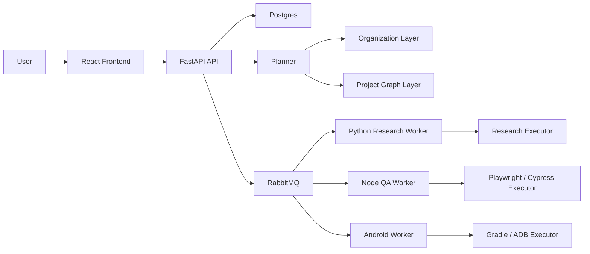

# ora-automation 구현 로드맵

## 0. 문서 목적

이 문서는 아래 세 설계 문서를 실제 코드 구현 순서로 내리기 위한 실행 로드맵이다.

1. [TOSS_REORG_PLAN.md](/Users/mike/workspace/side_project/Ora/ora-automation/docs/TOSS_REORG_PLAN.md)
2. [AGENT_ORG_CUSTOMIZATION_PLAN.md](/Users/mike/workspace/side_project/Ora/ora-automation/docs/AGENT_ORG_CUSTOMIZATION_PLAN.md)
3. [GENERALIZATION_ARCHITECTURE_PLAN.md](/Users/mike/workspace/side_project/Ora/ora-automation/GENERALIZATION_ARCHITECTURE_PLAN.md)

핵심 목표는 다음 세 가지다.

1. 토스식 조직 커스터마이징 구조를 유지한다.
2. Ora 전용 구조를 범용 멀티 테넌트 플랫폼으로 일반화한다.
3. R&D, QA, Ops 자동화를 서비스 그래프 기반으로 실행 가능하게 만든다.

---

## 1. 최종 목표 상태

최종적으로 `ora-automation`은 아래 구조로 동작해야 한다.



핵심 계층은 다음 네 층이다.

1. `프로젝트 계층`: Tenant / Workspace / Repository / Service / Project Graph
2. `조직 계층`: Organization / Silo / Chapter / Agent
3. `오케스트레이션 계층`: Intent / Planner / Deliberation / Consensus
4. `실행 계층`: Worker / Executor / Artifact / Report

---

## 2. 구현 원칙

### 2.1 반드시 유지할 것

1. 토스식 `사일로 + 챕터`
2. 조직별 멀티 에이전트 커스터마이징
3. LangGraph 기반 수렴형 토론 구조
4. 대화와 조직 연결
5. Gemini 기반 조직 추천 흐름

### 2.2 반드시 바꿀 것

1. Ora 전용 고정 service enum
2. 레포명 기반 분기
3. repo 중심 실행 방식
4. 모든 target을 하나의 실행 경로로 몰아넣는 구조

### 2.3 구현 기준

1. `오케스트레이션 로직`은 in-process
2. `외부 도구 실행`은 런타임별 worker/executor로 분리
3. `자동 분석 결과`와 `운영 확정 결과`는 분리 저장
4. `레포`가 아니라 `서비스` 단위로 실행

---

## 3. 구현 순서 개요

전체 구현은 8개 Phase로 나눈다.

| Phase | 이름 | 핵심 산출물 |
| --- | --- | --- |
| 1 | 스키마 고정 | DB schema, ERD, migration plan |
| 2 | 프로젝트 그래프 도입 | Observed/Curated Graph 저장 구조 |
| 3 | 온보딩 분석 파이프라인 | repo scan -> service graph 생성 |
| 4 | 조직/그래프 통합 플래너 | organization + project graph 기반 planning |
| 5 | executor registry 도입 | target 중심 실행 제거 |
| 6 | worker runtime 분리 | Python/Node/Android worker |
| 7 | 프론트엔드 온보딩/편집 UI | onboarding, graph review, org binding |
| 8 | 검증/운영 안정화 | e2e, telemetry, retry, artifact 정책 |

---

## 4. Phase 1 — 스키마 고정

## 목표

프로젝트 계층과 조직 계층이 같은 DB 안에서 충돌 없이 공존하도록 schema를 먼저 확정한다.

## 작업 항목

1. `tenants`
2. `workspaces`
3. `repositories`
4. `services`
5. `service_capabilities`
6. `service_dependencies`
7. `execution_profiles`
8. `observed_project_graphs`
9. `curated_project_graphs`
10. `secret_sets`
11. `orchestrations`
12. `orchestration_runs`
13. `run_steps`

조직 관련 기존/예정 테이블은 다음과 정합성을 맞춘다.

1. `organizations`
2. `organization_silos`
3. `organization_chapters`
4. `organization_agents`
5. `chat_conversations.org_id`

## 산출물

1. ERD 문서
2. SQLAlchemy 모델 초안
3. migration 순서 정의
4. FK/인덱스 정책

## 완료 기준

1. 새 schema가 조직 schema와 충돌하지 않는다.
2. workspace 하나가 여러 repo와 여러 service를 가질 수 있다.
3. organization은 workspace와 느슨하게 연결되며 독립 유지된다.

## 리스크

1. organization 모델과 workspace 모델의 책임이 섞일 수 있음
2. repo와 service 경계가 불명확하면 이후 executor 분기가 꼬임

---

## 5. Phase 2 — Project Graph 도입

## 목표

코드 분석 결과를 단순 로그가 아니라 실행 가능한 그래프 구조로 저장한다.

## 작업 항목

1. `Observed Graph` JSON Schema 정의
2. `Curated Graph` JSON Schema 정의
3. graph validation 모듈 추가
4. graph versioning 정책 추가
5. graph diff 전략 정의

## 핵심 구조

1. repositories
2. services
3. dependencies
4. profiles
5. policies
6. metadata

## 산출물

1. JSON Schema 문서
2. Python serializer/deserializer
3. graph validation 테스트
4. sample graph fixtures

## 완료 기준

1. workspace 분석 결과를 observed graph로 저장 가능
2. 사용자가 수정한 결과를 curated graph로 따로 저장 가능
3. orchestration은 curated graph가 있으면 그것만 사용

---

## 6. Phase 3 — 온보딩 분석 파이프라인

## 목표

사용자가 GitHub org/repo를 등록하면 플랫폼이 자동으로 서비스 구조를 추론한다.

## 작업 항목

### Stage A. 연결

1. GitHub App 또는 PAT 등록
2. repo 선택
3. clone/fetch job 생성

### Stage B. 정적 스캔

다음 파일을 우선 탐지한다.

1. `package.json`
2. `pnpm-workspace.yaml`
3. `turbo.json`
4. `pyproject.toml`
5. `requirements.txt`
6. `build.gradle`
7. `settings.gradle`
8. `pom.xml`
9. `docker-compose.yml`
10. `Dockerfile`
11. `README.md`
12. `.github/workflows/*`

### Stage C. 서비스 추론

규칙 기반:

1. build tool
2. test tool
3. runtime
4. framework

LLM 기반:

1. 서비스 경계 추론
2. 문서 기반 역할 해석
3. 서비스 설명 자동 생성

### Stage D. 의존관계 추론

1. API base URL
2. compose/network 설정
3. env references
4. docs references
5. 코드 import 패턴

### Stage E. 실행 프로파일 추론

1. `node-playwright`
2. `node-cypress`
3. `python-fastapi-pytest`
4. `spring-gradle`
5. `android-gradle`

## 산출물

1. onboarding job
2. observed graph 생성기
3. detector 결과 로그
4. confidence score

## 완료 기준

1. 새 workspace 등록 시 observed graph 자동 생성
2. service, dependency, profile이 최소 수준으로 추론됨
3. confidence가 낮은 항목은 UI 수정 대상으로 표시됨

---

## 7. Phase 4 — 조직/그래프 통합 플래너

## 목표

조직 구조와 프로젝트 그래프를 동시에 입력으로 받아 실행 계획을 만든다.

## 핵심 질문

1. 누가 판단하는가
2. 무엇을 실행하는가
3. 어떤 서비스가 먼저 준비되어야 하는가
4. 어떤 executor가 필요한가

## 작업 항목

1. planner input contract 정의
2. organization serializer 정리
3. curated graph loader 추가
4. deliberation input에 `org + graph + recent runs + user intent` 통합
5. consensus output에 실행 계획 포함

## planner 출력 예시

```json
{
  "intent": "qa",
  "scope": "services",
  "target_service_ids": ["svc_web", "svc_api"],
  "required_capabilities": ["web-ui", "http-api", "e2e"],
  "execution_plan": [
    {"step": "start_api", "service_id": "svc_api"},
    {"step": "healthcheck_api", "service_id": "svc_api"},
    {"step": "run_e2e_web", "service_id": "svc_web"}
  ]
}
```

## 산출물

1. planner contract
2. execution plan schema
3. organization + graph aware deliberation path

## 완료 기준

1. 동일한 조직이라도 대상 graph에 따라 다른 계획을 생성함
2. 동일한 graph라도 선택 조직에 따라 다른 판단 결과를 낼 수 있음

---

## 8. Phase 5 — Executor Registry 도입

## 목표

현재의 target 문자열 중심 실행 구조를 제거하고, service/profile 기반 실행 구조로 바꾼다.

## 작업 항목

1. `ExecutorRegistry` 추가
2. `ResearchExecutor`
3. `VerifySourcesExecutor`
4. `PlaywrightExecutor`
5. `CypressExecutor`
6. `PytestExecutor`
7. `GradleExecutor`
8. `AndroidInstrumentationExecutor`

## 원칙

1. research는 Python 함수 호출
2. graph validation은 Python 함수 호출
3. Node 런타임 테스트는 Node worker 직접 실행 우선
4. Gradle/adb는 외부 도구 실행 허용

## 산출물

1. executor registry
2. target -> executor 변환 제거
3. service/profile -> executor 선택 구조

## 완료 기준

1. `run-cycle` 같은 이름이 아니라 planner output 기반으로 executor가 선택됨
2. QA target이 research pipeline으로 잘못 들어가지 않음

---

## 9. Phase 6 — Worker Runtime 분리

## 목표

Python 프로세스가 모든 걸 직접 실행하지 않도록 런타임별 worker를 분리한다.

## worker 종류

### python-research-worker

담당:

1. 코드 분석
2. 문서 분석
3. 웹/논문 리서치
4. LangGraph 토론
5. 보고서 생성

### node-qa-worker

담당:

1. Playwright
2. Cypress
3. web E2E bootstrap

### android-qa-worker

담당:

1. Gradle
2. adb
3. emulator
4. instrumentation

## 작업 항목

1. queue routing key 설계
2. worker registration 구조
3. artifact/log 수집 규약
4. timeout/retry 정책 분리

## 완료 기준

1. research run과 web QA run이 서로 다른 worker에서 처리됨
2. Android 실행 체인이 Python research worker를 오염시키지 않음

---

## 10. Phase 7 — 프론트엔드 온보딩/편집 UI

## 목표

일반 사용자가 GitHub repo를 등록하고, 분석 결과와 조직을 연결할 수 있게 한다.

## 화면 단위

1. GitHub 연결 화면
2. repo 선택 화면
3. observed graph 검토 화면
4. curated graph 수정 화면
5. organization 선택/추천 UI
6. orchestration 실행 화면
7. 결과 보고서 화면

## 작업 항목

1. onboarding wizard
2. graph editor 초안
3. service dependency viewer
4. execution profile 수정 UI
5. org binding UI

## 완료 기준

1. 사용자가 코드를 몰라도 onboarding 가능
2. 추론 오류를 UI에서 바로 수정 가능
3. 조직 선택 후 QA/R&D 실행 가능

---

## 11. Phase 8 — 검증/운영 안정화

## 목표

이 구조가 실제 운영 가능한 수준인지 확인한다.

## 검증 축

### 기능 검증

1. onboarding
2. graph 생성
3. graph 확정
4. org 선택
5. research 실행
6. QA 실행
7. artifact 저장

### 안정성 검증

1. retry 정책
2. partial failure 정책
3. long-running run 복구
4. artifact cleanup

### 운영 검증

1. run telemetry
2. worker health
3. queue backlog
4. per-tenant isolation

## 완료 기준

1. research와 QA가 같은 플랫폼에서 안정적으로 공존
2. workspace마다 다른 repo 구조를 수용
3. organization customization이 실제 deliberation에 반영됨

---

## 12. 우선순위

## 12.1 반드시 먼저 할 것

1. Phase 1
2. Phase 2
3. Phase 4
4. Phase 5

이 네 개가 핵심 뼈대다.

## 12.2 병렬 가능한 것

1. Phase 3 온보딩 분석기
2. Phase 7 UI

다만 schema와 graph contract가 고정된 뒤에만 병렬로 가야 한다.

## 12.3 늦춰도 되는 것

1. Android worker 고도화
2. Guest / Joint 협업 세부 기능
3. 고급 시각화

---

## 13. 실제 구현 순서 제안

### Sprint 1

1. ERD 문서
2. SQLAlchemy 모델 설계
3. migration 추가
4. graph schema 초안

### Sprint 2

1. observed/curated graph 저장
2. onboarding analyzer 1차
3. service detection
4. execution profile detection

### Sprint 3

1. planner contract 통합
2. organization + graph deliberation 연결
3. execution plan schema 추가

### Sprint 4

1. executor registry
2. research executor 정리
3. verify executor 정리
4. QA executor 도입

### Sprint 5

1. Node QA worker
2. Android worker
3. queue routing
4. artifact/log 정책

### Sprint 6

1. onboarding UI
2. graph review UI
3. execution profile edit UI
4. orchestration launch UI

### Sprint 7

1. end-to-end integration
2. failure recovery
3. telemetry
4. 운영 문서화

---

## 14. 성공 판단 기준

이 로드맵이 성공했다고 판단하려면 다음이 가능해야 한다.

1. Ora 프로젝트가 아닌 임의의 GitHub repo 구조도 onboarding 가능
2. repo 스캔 후 service graph 생성 가능
3. 사용자가 graph를 수정해 curated graph 확정 가능
4. 사용자가 조직을 선택하면 해당 조직이 deliberation에 반영됨
5. planner가 graph와 조직을 함께 보고 실행 계획 생성 가능
6. web QA는 node worker에서, research는 python worker에서, android는 android worker에서 실행 가능
7. 최종 결과가 하나의 보고서/아티팩트 체계로 정리됨

---

## 15. 바로 다음 액션

이 문서 기준 다음 작업은 아래 순서로 진행한다.

1. `ERD.md` 작성
2. `PROJECT_GRAPH_SCHEMA.md` 작성
3. 현재 코드 기준 `REFACTOR_SEQUENCE.md` 작성
4. 이후 Phase 1부터 실제 코드 구현 시작
